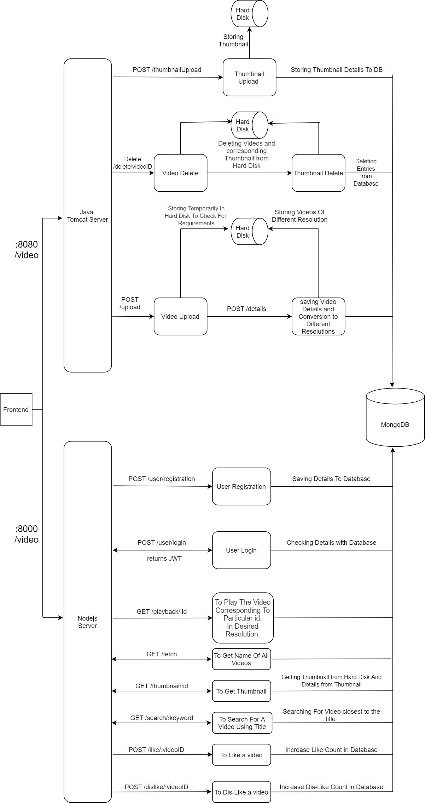

# StreamingApp
### Purpose Of This Application 
These days trend of short videos are on rise youtube recently realsed "Shorts" . So , taking inspiration from Youtube Shorts I decided to make this application which will allow user to upload 120 secs video .

### Tech Stack
This Project uses uses Server Side Capabilities of Nodejs and Spring Boot.       
Reasons To Use ->    
1) Java for All Kinds of Upload and Conversion Of videos to Different Resolution Process as this process is CPU intensive.So,it's better to handle it in Java.
2) Nodejs for Playback , Authentication-Authorization as these are just some simple I/O operations which NodeJs is pretty good at.

### Backend Architecture / System's Design

### End Points
| End Point      |   Port Number | HTTP Method   |           Description                   |  Required User registration |
| :---            | :----:  |    :----:     |          :----:                           | ---:   |
| /video/upload    | 8080 | POST          | To Upload Videos                        |  Yes |
| /video/details    | 8080 | POST          | To associate Detail of Video uploaded  |  Yes |
| /video/thumbnailUpload    | 8080 | POST          | To Upload Thumbnail                        |  Yes |
| /video/delete/:videoID    | 8080 | DELETE          | To Delete Uploaded Videos and thumbnail corresponding to it |  Yes |
| /video/fetch      | 8000 | GET           | To Fetch All Available Videos           | No   |
| /video/thumbnail/:id      | 8000 | GET           | To Fetch thumbnail associated with a video  | No   |
| /video/user/registration|8000 | POST | To register the user |  No |
| /video/user/login|8000 | POST | for User Login returns jwt in response |  No |
| /video/search/:keyword|8000 | GET | For Video Search |  No |
| /video/playback/:id|8000 | GET | For Video Playback |  Yes |
| /video/like/:id|8000 | POST | For Liking The Video |  Yes |
| /video/dislike/:id|8000 | POST | For Dis-Liking The Video |  Yes |

### Different Models 
##### - User Registration Model ( To Pass in the Body of the API)
username*  
password  
firstName  
lastName  
email*    
countryOfUser   
role   
Here &ast; signify that those fields need to be unique.  

##### - Video Details Model ( To Pass in the Body of the API)   
fileName*  
videoLength*    
titleOfVideo   
captionOfVideo   
uploadTime*   
genreOfVideo    
Here &ast; signify that You Will Receive it as response if uploaded video is going to be of required criteria.   

##### - Video Details Model ( To Pass in the Body of the API)   
thumbnailName (same as name of the Video Generated)     
videoID         
thumbnailExtension   

### Things Needed To Be Implemented In Future 
- ~~Authentication-Authorization~~
- ~~The One who has uploaded can delete the videos~~
- ~~Adding Likes And DisLikes~~
- ~~JWT's Origin Verification~~
- User Interface
- Handling Some Exceptions  
- Ability To Add Comments.
- OAuth Authentication 
- Need To Add Web Server ( like Nginx ) which supports Reverse Proxy

